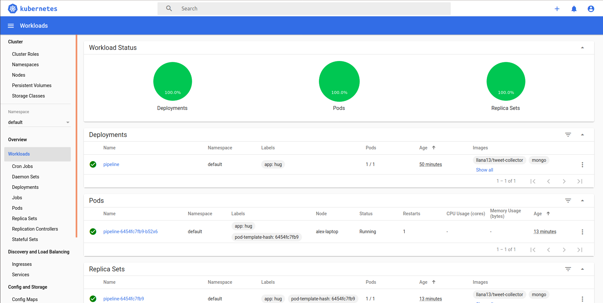
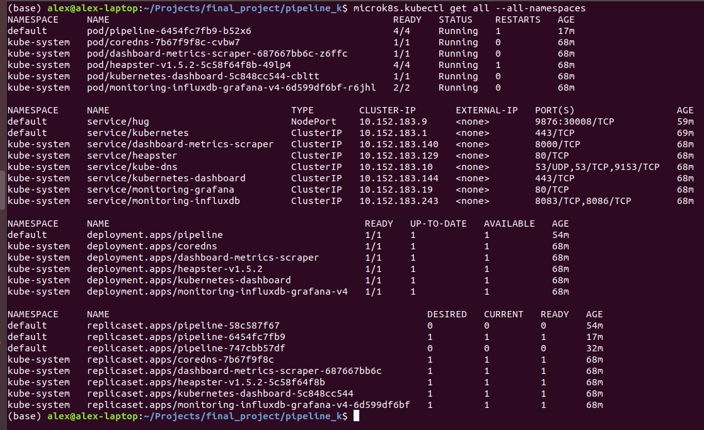
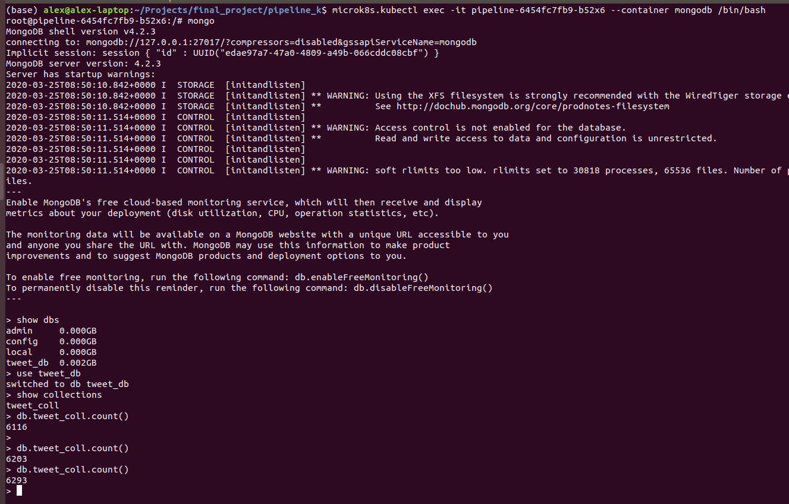

The purpose of this project is to deploy the pipeline application (see https://github.com/Llana13/Pipeline) in Kubernetes.

The application perform 2 steps:

* Intercept tweets that match some pre-defined characteristics (such as location, language, topic...) and store them in a MongoDB

* From the MongoDB retrieve the corpus information of the tweet, stract the sentiment scores and send them to a PostgreSQL database where they are ready to use

In order to perform this steps, 4 Docker images are needed:

* Tweet-collector - self made 

* MongoDB - oficial image

* ETL-job - self made and available in my personal Docker Hub (https://hub.docker.com/u/llana13)

* PostgreSQL - oficial image

My Kubernetes dashboard with the pipeline up and running:

Summary of my namespace where you can see all the basic components and their status:

Through the Kubectl I can open a command line inside the containers and intereact with the databases to check the information already stored.

MongoDB's container:

Same process but here inside PostgreSQL container:

