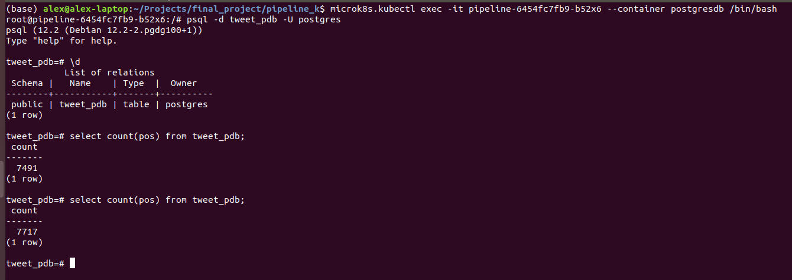

* In order to collect tweets and to proccess them afterwards, I need to upload two Docker images to DockerHub to make them reachable to Kubernetes

* Create a deployment to connect my four containers:
	* Tweet collector
	* Mongo datase
	* ETL process
	* Postgres database

* This deployment will automatically create the containers inside a unique pod

This is the basic look of the Kubernetes dashboard where you

